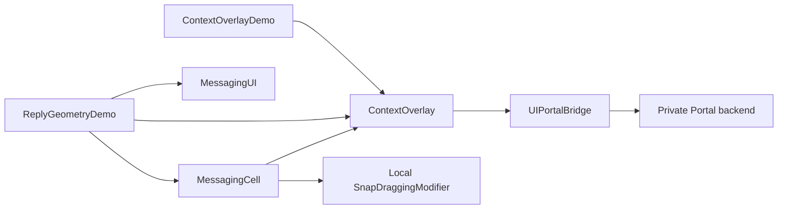

# ContextOverlay

`ContextOverlay` は、既存の UIKit view のライブ描画を、呼び出し側が定めた位置へ移動して見せる Swift Package product / target。iOS 17 以降を対象とし、message、reply、`MessagingCell`、`MessagingUI`、`TiledView` を知らない。選択した context の型、開始 gesture、背景、destination の配置と action は呼び出し側が決める。

現在の production adapter `Sources/ContextOverlay/PortalMirror.swift` は、[Aeastr/UIPortalBridge](https://github.com/Aeastr/UIPortalBridge) 1.0.0 の typed UIKit wrapper を使う。独自の private class lookup や KVC setter を持たず、`sourceView`、`hidesSourceView` と matching flag を wrapper の property で設定する。wrapper の `isAvailable` が false ならエラーにし、同 library の透明な unavailable fallback をライブ描画として受け入れない。snapshot や別に生成した SwiftUI view への fallback もない。

`UIPortalBridge` の backend は private `_UIPortalView`。wrapper の public `sourceView` getter は stored reference なので、その一致だけで private backend の binding まで確認したとは扱わない。production の diagnostic は `source reference === renderingView` と表示する。test は内部 backend の `sourceView` と `hidesSourceView` を別に読み、実際の binding と非表示化を確認する。移行後の build・test・runtime は末尾に記録し、旧 backend の結果と分ける。

## 依存と責務



`MessagingCell` は source の所有と、iOS 18 以降の SnapDraggingModifier による物理的な右スワイプを担当する。`CellSource` は `ContextOverlaySource` の typealias で、同じ参照を `ContextOverlayState.present(_:from:velocity:)` へ渡せる。`ContextOverlay` から cell や list への逆向きの依存はない。一般的な UIKit source は `ContextOverlaySource` を直接使い、tap などの zero-velocity 表示もできる。`MessagingUI` と `ContextOverlay` の iOS 17 対応は維持し、`MessageCell` の iOS 18 要件と分ける。

| API | 責務 |
| --- | --- |
| `ContextOverlaySource` | 既存描画 view と静止 container の weak reference、同一 window 内の座標変換 |
| `ContextOverlayState<Context>` | 選択した context、Portal の接続・解除、phase、開始・復帰 animation |
| `ContextOverlayPresentation<Context>` | context、source、元の寸法、destination 用の一つの `sourcePlaceholder` |
| `ContextOverlay(state:content:)` | source と destination の geometry proxy を同一 host に置き、一つのライブ描画を追従させる |
| 呼び出し側の画面 | 元 source の寿命、gesture、背景、destination の配置・controls、context 固有の意味 |

`Context` は任意の型で、`Message`、`Identifiable`、`Equatable` などの制約はない。presentation 自体は毎回独立した ID を持つ。状態と UIKit source の操作は main actor で行う。

`ContextOverlaySource.frame(in:)` は UIKit の変換に加えて、owner が `setDrawingTranslation(_:)` で渡した visual translation の remainder を反映する。SwiftUI GeometryEffect などで UIView の変換に現れない移動がある場合に使い、UIKit transform / 変換がすでに含む移動をもう一度加算しない。通常の UIKit card のようにすべてが UIView geometry に現れる source では追加値は zero のままでよい。

## 画面側の構成

画面は `ContextOverlayState` を `@State` などで安定して保持する。元内容は通常の hierarchy 内で mount したままにし、その上へ `ContextOverlay` を置く。以下は destination の部分だけを示す。`Project` と action は呼び出し側の型・処理である。

```swift
import ContextOverlay
import SwiftUI

@State private var overlay = ContextOverlayState<Project>()

// Place this view above the mounted source hierarchy.
ContextOverlay(state: overlay) { presentation in
  VStack(spacing: 20) {
    Text(presentation.context.title)
      .font(.headline)

    presentation.sourcePlaceholder

    Button("Keep for later") {
      save(presentation.context)
    }
    Button("Close") { overlay.dismiss() }
  }
  .frame(maxWidth: .infinity, maxHeight: .infinity)
  .background(Color(.systemBackground).opacity(0.94))
  .opacity(overlay.isPresented ? 1 : 0)
}
```

destination の builder には **一つだけ** `presentation.sourcePlaceholder` を挿入する。これは元 source と同じ寸法の透明な footprint で、内容を再生成しない。Stack や ScrollView 内に配置でき、title・button・input などの controls を周囲へ置ける。背景と controls をいつ表示するかも呼び出し側が決め、`isPresented` を opacity などへ使える。return 中は overlay が destination の controls を disable にする。

開始 gesture は module に含めない。tap は `overlay.present(project, from: source)`、swipe release は `overlay.present(project, from: source, velocity: releaseVelocity)` を呼ぶ。velocity は overlay の軸に沿った物理速度 `CGVector`（pt/s）で、既定値は zero。戻り値 `true` は handoff の受理を示し、接続の完了ではない。別の presentation がある、元 source の window・bounds・geometry が無効、bridge が unavailable の場合は `false` を返す。overlay の座標 marker が先に attach される必要があるため、`ContextOverlay` は選択時だけ別の hierarchy へ作るのではなく、元画面の `.overlay` に常設する。

zero-velocity entry と復帰に使う既定の `animation` は `.spring(response: 0.45, dampingFraction: 0.82)`。`ContextOverlayState(animation:)` または `animation` property で変更できる。非zero velocity の entry は source と destination の中心を結ぶ displacement へ速度を一度だけ投影し、`dot(velocity, displacement) / displacement.lengthSquared` を spring の initial velocity（progress/s）へ渡す。destination は同じ overlay host の `sourcePlaceholder` が frame を測り、bridge 接続とその測定の両方が揃ってから entry を始める。

この velocity entry は `interpolatingSpring`、bounce `0.18`、`presentationSpringDuration`（既定 `0.45 s`）を使う。Slow などの速度変更では `animation` と `presentationSpringDuration` の両方を設定する。path に垂直な速度は別の x/y 軌道としては保持しない。source から destination へ位置を補間する path に対する scalar momentum であり、物理的な二軸の velocity がそのまま連続する実装ではない。投影の契約を test、Portal の往復を Simulator で確認した範囲は末尾に記す。

## phase と source の引き継ぎ

| `ContextOverlayPhase` | 状態 | gesture source 側での扱い |
| --- | --- | --- |
| `.idle` | Portal がなく、選択がない | 新しい開始を許可する |
| `.preparing` | source geometry を捕捉し、bridge 接続と必要な destination 測定を待つ | release 位置を維持する |
| `.presenting` | bridge の接続処理が完了し、destination へ移動中 | 隠れた source の translation を reset できる |
| `.active` | destination に表示中 | source を mount したまま保持する |
| `.dismissing` | 静止した source 位置へ復帰中 | 接続と source の寿命を復帰完了まで保つ |

`isSourceHidden` は `.presenting`、`.active`、`.dismissing` で true になる。bridge の接続・hide 設定の処理を済ませ、必要な destination 測定が揃った後の acknowledgement であり、swipe source の translation を reset する境界になる。stored source getter の検査と actual backend の検証は前述のとおり分ける。`isPresented` は `.presenting` と `.active` で true、`isDismissing` は `.dismissing` で true。

`MessagingCell` の場合は、選択した source に対し `isSourceHidden ? .presented : .preparing` を `CellReplyPhase` へ投影し、選択されていなければ `.idle` にする。これにより、指を離した drag 位置から Portal が始まり、hidden の確認前に元位置へ snap back しない。tap からの source では drawing frame と resting frame を同じ位置にしてよい。

Cell release の model target と、spring の途中の drawing offset は別の値。modifier は `GeometryEffect.effectValue` で実際に評価した offset を plain reference に capture し、Cell は release 時に source の visual translation を更新してから `present` する。overlay が drawing frame と raw velocity を捕捉した後、Cell の local spring は velocity を zero にしてその drawing offset を保持する。overlay は release の model target の位置から始める構成ではない。

`dismiss()` は captured resting frame へ戻し、animation の終了後に Portal を解除する。`cancel()` は animation を待たず同期的に描画元を復元する。画面の離脱では `ContextOverlay` が cancel し、画面独自の終了処理から明示的に cancel することもできる。

## 任意の UIKit source

`ContextOverlaySource` は描画 view を retain しない。source を作った component が、描画 view と静止 container を所有する。独立した view の場合は両方へ同じ view を渡せる。swipe で描画 view を動かす場合は、transform しない container を別に渡す。

```swift
// During source setup, while its owner retains both views:
source.bind(renderingView: renderingView, containerView: containerView)

// From attachment and layout callbacks:
overlay.sourceDidChange(source, attached: containerView.window != nil)

// Before teardown, rebinding, or reuse changes the rendering identity:
overlay.sourceDidChange(source, attached: false)
source.unbind(from: containerView)
```

attachment・layout・detach は UIKit owner の `didMoveToWindow`、`layoutSubviews`、teardown などから通知する。detach や変更を通知すると、Portal を同期的に切断し、SwiftUI の observable state の終了は次の main run loop へ送る。古い container からの `unbind(from:)` は新しい binding を解除しない。元 component を別 item へ再利用する前にも、consumer を切断するための false 通知を行う。

同じ source 参照を新しい rendering へ bind した場合、古い owner の遅れた通知が新しい rendering や drawing translation を書き換えないようにする。MessagingCell は現在の binding ownership と teardown を guard している。任意の UIKit owner にも同じ寿命の管理が必要で、weak な source 参照だけで再利用中の意味上の同一性を保証するものではない。

表示中も元 source を mount したまま保つ。Portal が元表示を隠しても、source の animation や task の所有権が overlay へ移るわけではない。source identity、window、bounds、captured resting frame が変わったことを検知した場合は、現在の実装は継続せず cancel する。座標変換の丸めを変更事故と扱わないよう、return frame の各成分の差が `0.5 pt` 未満なら許容する。親の scroll など全変更が owner の layout callback で必ず通知されるとは限らないため、元 hierarchy の操作を止めるか、必要な通知を追加するかも画面側の責任になる。

## 現在の制約と検証

現在は元の幅・高さを維持し、表示位置だけを補間する。source の座標を overlay 座標へ変換した x・y 軸を確認し、scale と rotation は共有 ancestor に掛かっている場合も受け付けない。軸の数値判定と描画 frame / resting frame の寸法差にも `0.5 pt` 未満の丸めの許容を持つ。destination の幅変更による再レイアウトや改行は含まない。Portal の payload は表示専用で hit testing を無効にしており、元 view 内の button を destination で操作する設計ではない。操作する controls は placeholder の周囲に置く。

placeholder に付けた背景、mask、opacity、corner radius や、その ancestor ScrollView の clipping が、別 sibling にある Portal payload へ自動的に適用されるわけではない。現在の placeholder は位置と寸法のためのものとして使う。これらの effects を含めた描画制御は別の実装・検証が必要になる。

development app の `Context Overlay` は message を使わず、通常の SwiftUI ScrollView に一つの UIKit card を置く。card 自身が独立した render ID、`UIActivityIndicatorView`、elapsed counter の Timer を持ち、destination のための二つ目の card を作らない。Timer は source の window attachment 中だけ動作する。

### 汎用抽出時の旧 backend の記録

2026年10月2日、UIPortalBridge / SnapDraggingModifier 移行前の own Portal backend を使い、iPhone 18 Pro / iOS 27.0 Simulator で次を確認した。

| 対象 | 結果 | 確認範囲 |
| --- | --- | --- |
| UIKit card の描画 | source・active overlay・Close 後で render ID `26D623` が同じ | 別の card を描画せず同じ source を表示した往復 |
| source の更新 | elapsed counter が `68.6 → 90.5 → 132.4 s` と進み、spinner が動き続ける | frozen snapshot ではなく、overlay 表示中も同じ view の更新が続く |
| destination の操作 | `Keep for later` を押すと呼び出し側の文言が `Saved for later` に変わる | placeholder 周囲の通常の SwiftUI controls が操作できる |
| backend の接続 | `_UIPortalView`、`source === renderingView`、crop `362 × 148 pt` をログで確認 | private class と元 UIView の getter identity を照合 |

この旧実装の package test は `ContextOverlayTests` 10件と `MessagingCellTests` 6件の計16件が成功した。context の保持、接続 acknowledgement、cancel と元表示の復元、detach、古い callback、resize、座標 view の detach、fractional な translation、共有 scale / rotation の拒否、return frame の丸めの許容と大きな移動の cancel を含む。これらは固定 geometry の契約と有限の demo 操作列の確認であり、任意の source、動画 surface、Dynamic Type、更新・再利用中の継続表示や実機まで成立したとは扱わない。

移行前の最終 development app build は Debug / iOS Simulator で成功した。新しい `ContextOverlay` の warning / error はなく、既存 Dev コードの warning 4件が残る。同じ Simulator で、reply adapter の短文受信 `F59CA9` と送信 `4BA364` の右 swipe、同じ ID を保持した表示と復帰、overlay の縦 drag・bounce、左 timestamp reveal、縦 list scroll を確認した。当時の own backend の接続ログに `_UIPortalView` と private source getter identity を確認し、この run の runtime / OS log には matched geometry source 重複、SwiftUI update 中の state mutation、Auto Layout constraint conflict の警告はない。

抽出後の長文、animation 中断や多様な再入力は今回の操作列に含めない。以前の reply 実験の成功と、新しい generic card / reply adapter の結果は [段階別の検証記録](Reply-Overlay-Feasibility.md) に分けて残す。

### UIPortalBridge / SnapDraggingModifier 移行の確認範囲

local SnapDraggingModifier は upstream main commit `5ec2f79cac340e91059394f935f5fc973840b7d1` に admission・enabled・recognizer hook、eager な UIKit host への取り付け、`cancelTargetOffset`、GeometryEffect の drawing capture と release / drawing callback を加えた dependency。rubber band、release velocity の正規化と spring は upstream 実装を保持する。出所と差分は [Vendor README](../Vendor/swiftui-snap-dragging-modifier/README.md) に記す。

2026年10月2日、iPhone 17e / iOS 27.0 Simulator で ContextOverlay / Cell の関連30件と Vendor の25件が成功した。actual backend の binding・hide・解除、source の追加 translation、古い binding の teardown、destination 測定と signed velocity の投影を含む。development app の最終 incremental build も19:23:06 JSTに成功した。

汎用 UIKit card は render ID `E48525` のまま、source の elapsed `27.0 s`、overlay の `48.0 s`、復帰後の `64.3 s` を確認した。元位置の描画は隠れ、overlay でも spinner と counter が更新される。reply の初回 swipe・復帰・再入力、縦 list scroll、左端 back も確認した。移動 path に垂直な速度の保持は未実装。実機、keyboard、更新・再利用中の継続表示、今回の移行後の左 reveal の描画は未検証。[詳しい操作列と実録画](Reply-Overlay-Feasibility.md)を参照。
