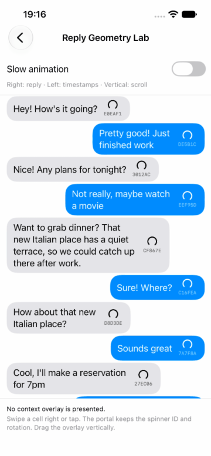

# Reply overlay と ContextOverlay の実現可能性

セルのスワイプから、選択した吹き出しが会話の前面へ移動して見える reply 表示を検討する。描画の共有、座標の補間、gesture の引き継ぎを別々に検証する。2026年10月2日の `MessagingCell` 導入と `ContextOverlay` 汎用抽出では、own Portal backend によるライブ描画と geometry proxy への往復を Simulator で確認した。現在は production adapter を `UIPortalBridge`、Cell gesture を upstream `SnapDraggingModifier` の local extension へ移行した。Portal の往復を Simulator、release velocity の spring 投影を test で確認した範囲は末尾の移行記録に記す。以下の以前の成功は、新しい bridge / gesture / velocity path の実行証拠には使わない。reply 入力、keyboard、再利用中の継続表示、実機を含む全体の成立や iMessage と同等の動作はまだ確認していない。

最終表示は、背景の会話を暗くし、選択した吹き出しを reply 入力欄の上へ浮かせる形を仮定する。最初の検証にはキーボード、送信、reply データモデルを含めない。

## 技術上の判断

現在の development app は `UIPortalBridge` の typed UIKit wrapper を経由して元セルの描画をライブで複製し、`matchedGeometryEffect` でその表示位置を補間する。wrapper の内部 backend は private `_UIPortalView`。描画共有と位置補間は独立した問題であり、さらに release velocity の handoff と gesture の中断・再入力、更新・再利用を分けて確認する。

`MessagingCell` は描画 view の所有、weak な `CellSource`、物理的な右スワイプと caller-owned phase を担当する product / target で、`MessagingUI` や `TiledView` へ依存しない。現在は `ContextOverlay` と vendored `SwiftUISnapDraggingModifier` に依存し、`CellSource` は `ContextOverlaySource` の typealias。`MessageCell` の directional gesture は iOS 18 以降だが、package 全体、`MessagingUI` と `ContextOverlay` は iOS 17 対応を維持する。`PortalMirror.swift` は `UIPortalBridge` 1.0.0 の公開 property を使い、独自の private runtime lookup / KVC setter を持たない。bridge の private backend まで public Apple API と扱うものではない。API と呼び出し側の責任は [MessagingCell](MessagingCell.md)、[ContextOverlay](ContextOverlay.md) に記す。

元セルと overlay で別の SwiftUI view を描画しても、静的な吹き出しを移動して見せる実験はできる。ただし、元の `@State`、task、動画や loading の実体が同じであることは証明できない。「移動が連続する」と「同じ描画が生き続ける」は別の合格条件にする。

## 現在の構造

| 対象 | 現状 | 検証への影響 |
| --- | --- | --- |
| セルの描画 | SwiftUI `MessageCell` の子の UIKit host が `UIHostingConfiguration.makeContentView()` を所有する。実験では `TiledView` に内包する | modifier が描画 subtree を動かし、外側 background の静止 UIKit marker が return slot を保つ |
| source 参照 | `CellSource` は汎用 `ContextOverlaySource` の typealias。描画 view と container を weak で参照する | collection cell の ancestor lookup を使わず、dragged frame と静止 frame を別に取得できる |
| overlay | `ContextOverlayState<Context>` と `ContextOverlay` が Portal と geometry proxy を所有する | reply demo は `Context` に `Message` を使う。一般 source は message・Cell・TiledView を必要としない |
| スワイプ | `MessageCell` は iOS 18 の SnapDraggingModifier directional mode に right admission を渡し、`TiledView` の共通 `CellReveal` は左方向の横 pan のみ開始する | package が drag / rubber band / velocity / spring を所有し、Cell は方向と公開 recognizer の failure relationship を調停する |
| release | `CellReplyRelease` は rubber-band の model target と物理速度（pt/s）を持ち、`onReply` が source とともに受け取る | 受理は model の距離 `64 pt` または正の velocity の `0.12 s` 投影、handoff の frame は別に capture した描画位置を使う |
| セルの生成 | `cellBuilder` は UIKit view 作成時に保持され、更新されない | 変化する selection 値を closure で捕まえず、安定した session 参照を使う |
| サイズ測定 | 表示セルと同じ builder と state で off-window の測定用セルを作る | geometry source や source registry が測定用セルを拾わないことを確認する |
| 座標 | 100,000,000 pt の仮想 content 空間を使う | layout attributes を overlay 座標として使わない |
| 描画範囲 | 全幅の行の spacer と padding の内側に `MessageCell` を置く | source bounds は bubble 全体で、全幅セルからの crop は不要 |
| 再利用 | `prepareForReuse` が hosting 内容を消し、更新も reconfigure する | 強参照だけでは portal の内容や item identity を保持できない |

根拠となるコードは `Sources/MessagingCell/MessageCell.swift`、`CellSource.swift`、`Sources/MessagingUI/Tiled/TiledViewCell.swift`、`TiledView.swift`、`TiledCollectionViewLayout.swift` と `Dev/MessagingUIDevelopment/Messenger/ReplyGeometryDemo.swift`。

## matchedGeometryEffect の確認範囲

Apple の説明では、同じ ID と namespace の view を同一 transaction 内で取り除き、別の場所へ挿入すると、window 空間の frame を補間する。描画自体は通常の transition が担当し、挿入されている `isSource: true` は一つでなければならない。[Apple documentation](https://developer.apple.com/documentation/swiftui/view/matchedgeometryeffect(id:in:properties:anchor:issource:))

この説明だけでは、実際の `UIHostingConfiguration` と外側 overlay の間で期待通り動くとは断定できない。既存の navigation demo の `matchedTransitionSource` も、今回の effect の成立を示すものではない。

初期検証では二つの構成を比較した。

1. 一つの SwiftUI host 内の通常の `VStack` と overlay。
2. 実際の `TiledView` セルと、その外側の SwiftUI overlay。

初期の `Reply Geometry Lab` は `TiledView` だけのサンプルに整理し、構成の切り替えと SwiftUI 基準リストを削除した。初期の比較結果は後述の検証記録に残す。現在の Portal 実験も実 `TiledView` を使い、spring、overlay の縦 `ScrollView`、セル内の spinner と描画 ID を維持している。

初期の geometry 比較では、同じ namespace、ID、bubble 内容、固定サイズ、animation を使った。選択した行の高さを残し、source の取り除きと overlay の挿入を一回の `withAnimation` で行い、通常速度と低速で開始・途中・終了・復帰を観察した。これは別の SwiftUI bubble を描く比較用の baseline であり、ライブ描画の同一性を証明する構成ではない。

現在は cross-host の直接 matching を使わず、UIKit で測った source rect を **外側 overlay と同じ host 内の透明な geometry proxy** に渡す。source 位置と destination 位置の proxy は条件付きで切り替え、同時に挿入する `isSource: true` を一つにする。Portal は一つの永続的な payload として `isSource: false`、`properties: .position` で追従する。実セルの bubble は取り除かず、元の描画と寸法を維持する。

## Portal の確認範囲

WebKit の SPI 宣言には `CAPortalLayer`、weak `sourceLayer`、`matchesPosition`、`matchesTransform` がある。[WebKit source](https://github.com/WebKit/WebKit/blob/main/Source/WebCore/PAL/pal/spi/cocoa/QuartzCoreSPI.h)

Telegram は runtime lookup で private `_UIPortalView` を生成し、weak `sourceView`、`hidesSourceView`、`matchesAlpha`、position、transform などを扱っている。factory は alpha の追従と hit testing を無効にしている。[Telegram declaration](https://github.com/TelegramMessenger/Telegram-iOS/blob/master/submodules/UIKitRuntimeUtils/Source/UIKitRuntimeUtils/UIKitUtils.h)、[implementation](https://github.com/TelegramMessenger/Telegram-iOS/blob/master/submodules/UIKitRuntimeUtils/Source/UIKitRuntimeUtils/UIKitUtils.m)

overlay が位置を所有するため `matchesPosition`、`matchesTransform`、`matchesAlpha` を false にし、接続後に `hidesSourceView` を true にする。移行前の own backend では、iPhone 18 Pro / iOS 27.0 Simulator で、この組み合わせにより元表示を隠したままライブ描画を overlay へ出せることを確認した。現在の `UIPortalBridge` adapter も同じ flag を typed property で設定するが、新しい runtime の確認は別に行う。source の alpha・hidden や ancestor clipping を変更した場合など、他の組み合わせの成立は確認していない。

初期の `ReplyPortalMirror` と汎用抽出直後の `PortalMirror` は `_UIPortalView` を独自に runtime lookup し、必須 selector を確認して KVC で設定した。private source getter の identity も確認し、MessagingCell 導入時には `source === cell.renderingView`、汎用化直後には `source === renderingView` と表示していた。[Telegram implementation](https://github.com/TelegramMessenger/Telegram-iOS/blob/master/submodules/UIKitRuntimeUtils/Source/UIKitUtils.m) がこの旧実装の参照元である。

現在の production adapter は [Aeastr/UIPortalBridge](https://github.com/Aeastr/UIPortalBridge) 1.0.0 を実際の dependency として使う。`UIPortalBridge.UIPortalView` の `isAvailable` が false の場合は拒否し、library の透明な fallback を成功とは扱わない。wrapper の public source getter は stored reference なので、現在の diagnostic `source reference === renderingView` は private backend の getter identity と区別する。test では内部 backend の source getter と hide flag を別に読んで検証する。snapshot や別の SwiftUI bubble へ代替しない方針は維持する。

公開 UIKit API としての `UIPortalView` は確認できない。App Review 2.5.1 は public API の使用を要求しているため、開発用の技術検証が成立することと、配布するライブラリに採用できることは別に判断する。[Apple guidelines](https://developer.apple.com/app-store/review/guidelines/#software-requirements)

### 描画 source と座標 marker

空の `UIViewRepresentable` を吹き出しの background に置くと、その UIView で座標を測れる。しかし、その UIView は SwiftUI の吹き出しを描画する subtree を所有していない。marker を portal の source に渡すだけでは、内容が映る証明にならない。

初期の Portal 実験は bubble background の marker から ancestor の `UICollectionViewCell` を探し、`cell.contentView` 全体を source にした。marker bounds で bubble を crop するこの構成の結果は、後述の初期 Portal 記録に残す。

現在は `MessageCell` が所有する描画 view を `CellSource.view` から取得する。module に `UICollectionViewCell` の知識や ancestor lookup はなく、overlay の marker だけを座標変換先として使う。source の bounds origin が zero、寸法が正、同一 window 内で frame が取得できることを確認する。Portal の crop は source 自身の bounds、原点 `(0, 0)`。bubble の状態を再描画したり、全幅セルを切り出したりする必要がない。

`UIViewControllerRepresentable` を内包する案では、実際の `TiledView` の `UIHostingConfiguration` 内に unsupported を示す表示が出たため採用しなかった。UIView のみの container と `UIHostingConfiguration.makeContentView()` に変更して描画を確認した。`UIHostingConfiguration` の content に View Controller を含められない制約は [WWDC22: Use SwiftUI with UIKit](https://developer.apple.com/videos/play/wwdc2022/10072/) で説明されている。

### 元セルの寿命

source を強参照しても、セルが別 item に再利用されると異なる message が映るおそれがある。現在は各行の `@State` が一つの `CellSource` を保持し、source 自体が UIKit rendering と静止 marker を weak で持つ。選択は context の item ID と source identity で対応付け、同じ window に attach していない測定用 host は presentation の source にできない。古い container からの unbind は新しい binding を解除しない。

source と overlay marker の attachment/layout 通知時に、source identity、window attachment、source bounds、静止した return frame を確認する。不一致を検知した場合は同期的に Portal を切断して元表示を復元し、session を終了する。すべての親 scroll や configuration 変更を通知だけで検知できると断言しない。dismiss では逆 spring が終了するまで source 接続を保ち、その後 `hidesSourceView = false`、source binding の解除を行う。画面の離脱と Portal container の detach・dismantle でも接続を解除する。この方針は検知した変更時に実験を中止するものであり、更新や再利用を跨いでライブ表示を継続する設計ではない。

presentation 中にスクロールを一時的に止めることは初期実験の条件として使える。しかし、append、prepend、selected item の更新や削除まで安全になるわけではない。元セルを offscreen に維持する、所有する描画 host を分離する、更新時に session を終了する、といった方針は、必要な製品動作を踏まえて決める。

## 座標と animation の引き継ぎ

同じ `UIWindow` 内で、`CellSource.frame(in:)` が現在の swipe translation を含む開始 rect、`restingFrame(in:)` が動かしていない marker の return rect を取得する。二つを release 時に同時に捕捉し、開始は dragged frame、復帰は静止 frame へ向かう。gesture 終了でセルを一度 snap back させ、その後 overlay を出すと、連続性を失う。[Apple coordinate conversion](https://developer.apple.com/documentation/uikit/uiview/convert(_:to:)-2kf3d)

現在の local modifier は `GeometryEffect.effectValue` で評価した drawing offset を、modifier ごとの plain reference へ直接 capture する。これは rubber-band の model target や、後の async State 更新で追跡した値と区別する。四引数 release callback は model target と drawing offset の両方を Cell の内部へ渡し、Cell は UIKit の座標変換がすでに含む移動を差し引いた remainder だけを source の追加 drawing translation に設定する。SwiftUI の描画移動が UIView 変換に含まれない場合にも、frame へ反映し、含まれる場合は二重計上しない。

`onReply(source, release)` が `true` を返した後は caller の phase を `.preparing` とし、raw velocity を overlay に渡し済みの Cell が local spring 用の velocity を zero にする。終了 handler は現在の drawing offset を target として保持し、描画元が model target へ動き続けないようにする。bridge の接続・hide 設定の処理と destination 測定が揃い、overlay の `isSourceHidden` acknowledgement が true になった後に Cell を `.presented` へ移す。隠れた source の offset は animation なしで zero に戻す。validation はこの内部 reset を変更事故と扱わず、静止 marker の return frame を確認する。distance と正の projected velocity の条件を満たさない release や `onReply` の拒否では、modifier の spring で元位置へ戻る。

overlay の `present(_:from:velocity:)` は物理速度を source から destination の中心へ向かう displacement に投影し、`dot(velocity, displacement) / displacement.lengthSquared` を scalar initial velocity（progress/s）にする。velocity entry は placeholder の destination frame 測定と bridge 接続が揃ってから始まり、`interpolatingSpring` の duration は `presentationSpringDuration`（通常 `0.45 s`、Slow は `3 s`）、bounce は `0.18`。zero velocity の entry と復帰は既存の `animation` を使う。path に垂直な速度を独立した軌道で維持するものではない。投影の契約と Portal の runtime 確認は末尾の移行記録に記す。

現在の実験では source と同じ幅・高さのまま移動する。Portal の frame を変えることは、元 SwiftUI view を新しい幅で再レイアウトすることと同じではない。長文は元の改行を維持する範囲で確認し、destination での幅変更による改行や縮小は後の段階へ分ける。

採用する構成によっては UIKit property の更新も SwiftUI transaction に合わせる必要がある。`UIViewRepresentableContext.animate` の利用可能性は deployment target と SDK で確認してから扱う。[Apple animation bridge](https://developer.apple.com/documentation/swiftui/uiviewrepresentablecontext/animate(changes:completion:))

## 描画方法の比較

| 方法 | 強み | 成立を確認する点 |
| --- | --- | --- |
| SwiftUI を再描画 | public API で model や明示的 state を共有できる | local state と task の二重化、environment、テキストの再レイアウト |
| `snapshotView` | 既存の見た目を捕捉できる | 静止画像なので更新や進行中の animation は追わない |
| `_UIPortalView` | 元の描画をライブで複製する実装例がある | private API、source の寿命、非表示化、mask、動画 surface |
| 所有する UIView を移動 | 一つの描画実体を保つ設計候補 | セルの placeholder、host の所有権、復帰、サイズ測定 |

snapshot は方式比較上の基準であり、現在の実装には含めていない。未描画の source では内容がなく、snapshot 後の animation 更新も反映しないため、ライブ描画の最終条件とは区別する。[Apple snapshot documentation](https://developer.apple.com/documentation/uikit/uiview/snapshotview(afterscreenupdates:))

### セル内の animation probe

検証画面の各 bubble に、1.2秒で回転する spinner と、描画インスタンスごとの6文字の ID を付けた。回転はそれぞれの View で開始し、session の時計や角度を共有しない。現在の Portal 実験では元 bubble を常に mount したままにし、window attachment でその回転を有効にする。off-window の測定用セルは同じ寸法を保持し、回転を開始しない。

元セルと overlay で ID と回転位相が一致し、表示中も回転が続くことをライブ複製の確認条件にする。snapshot なら回転が止まり、独立した SwiftUI 再描画なら ID が変わる。spinner が動くだけでは portal の証拠にしない。portal のクラスと source 接続も別途確認する。

10月1日の geometry baseline は overlay に新しい bubble を生成したため、ID が変わるのが正しい結果だった。現在の Portal 実験ではこの再描画と元 bubble を取り除く分岐を廃止し、元の描画インスタンスを複製している。

iPhone 18 Pro Simulator / iOS 27.0 で、初期 baseline の SwiftUI と実 `TiledView` の両方のセルで回転を確認した。同一セルでは ID が維持され、再描画する overlay へ移動すると ID が変わることも確認した。10月2日の Portal 実験では、実 `TiledView` の source、overlay、元位置へ復帰した source で同じ ID が維持され、表示中も spinner が回転することを確認した。個別の結果は検証記録に記す。

## 段階と合格条件

下表の実行結果は own Portal backend と旧 Cell gesture、汎用抽出直後までの記録。現在の UIPortalBridge / SnapDraggingModifier / velocity handoff の確認範囲は末尾の移行記録で分ける。

| 段階 | 検証 | 次へ進む条件 | 現在の確認範囲 |
| --- | --- | --- | --- |
| 1 | 同一 host と実 `TiledView` の geometry 比較 | 一定サイズで往復でき、開始位置の飛び、二重表示、source の消失を評価できる | 初期 baseline を記録。cross-host の直接 matching は合格条件を満たさない |
| 2 | bubble の UIKit 座標と同一 overlay host 内の geometry node | source outline が上下端、スクロール後、safe area で一致する | 初期 Portal の短文・長文・右寄せ・スクロール後、module 化後の短文・送信・長文 swipe の開始と復帰を確認。上下端、safe area 変更、回転は未検証 |
| 3 | 単独 Portal と実セルの live mirror | 内容と animation が更新され、元表示を隠しても replica が残る。detach と解除が安全 | 初期 Portal の overlay drag・画面終了と、module 化後の短文・送信・長文 swipe の同一 ID・往復を確認。detach・再利用の網羅は未完了 |
| 4 | 対象を固定した swipe と overlay への引き継ぎ | 左 swipe の timestamp と縦 scroll を壊さず、現在位置から連続して浮く。cancel と再入力で破綻しない | 右 swipe の同一描画による往復、edge back 後の再入場・最初の長文 swipe を clean binary、閾値未満の復帰を diagnostic binary、左 timestamp・縦 list scroll を最終 clean binary でも確認。animation 中断や多様な再入力の網羅は未完了 |
| 5 | reply 入力、keyboard、復帰 | keyboard 中の resize と auto-scroll を含めて移動先を保持し、現在の source へ復帰できる | 未実装・未検証 |
| 6 | 更新と再利用、実コンテンツ、実機 | 削除、更新、append、prepend、offscreen、回転、長文、写真、Dynamic Type の結果を確認する。動画は独立検証 | 固定データの長文受信を確認。更新・再利用中の継続表示と実機は未検証 |

一つの段階で不成立なら、その原因と変更する設計を記録してから次へ進む。スクリーンショットの終点が合っているだけでは、途中の animation やライブ描画の合格としない。

## 状態の所有

reply 対象の message ID は会話画面側に持つ。将来の可視化 session は `idle → swiping → presenting → active → dismissing` の phase、対象 ID、source generation と geometry を扱い、reply の意味上の状態と途中の gesture・animation 状態を分ける。

現在の固定データ実験は安定した `ContextOverlayState<Message>` 参照で presentation、`isPresented`、`isDismissing`、source hidden の確認と source geometry を管理する。汎用 state の phase は `.idle → .preparing → .presenting → .active → .dismissing → .idle`。セルの handoff は `.idle → .preparing → .presented → .idle` を caller 側の状態から投影し、`isSourceHidden` の acknowledgement で hidden source の translation を reset する。dismiss 中も接続を保ち、source の変化を検知した場合は復帰 animation を継続せず実験を終了する。再利用を跨ぐ製品実装では現在の item ID で source を再取得し、元の index path を保持して戻さない。source が消えた、画面外、内容のサイズが変わった場合の表示は明示的に決める必要があり、古い rect へ戻る動作を成功と扱わない。

## 今回の検証記録

### 2026年10月1日: 初期 geometry baseline

段階1の検証画面 `Reply Geometry Lab` を development app の既存リストに追加した。`xcodebuild` で development app の Debug / iOS Simulator ビルドが成功した。iPhone 18 Pro / iOS 27.0 Simulator で短文の受信 bubble をタップし、通常速度と3秒の低速で表示・復帰を観察した。低速の結果は動画を記録し、フレームを抽出して確認した。

| 構成 | 確認した結果 | 判定 |
| --- | --- | --- |
| 同一 SwiftUI host と `.identity` transition | source が消え、destination へ位置が飛ぶ | この比較画面では不成立 |
| 同一 SwiftUI host と `.opacity` transition | source 位置から destination まで3秒で移動する。復帰も補間する | 静的な短文について geometry の基準を確認 |
| `TiledView` と外側 overlay の直接 matching | 移動が見える。ただし `.identity`、`.opacity` 両方で source 重複の runtime 警告。途中で他セルの描画と重なる | 見た目の移動は確認。本採用の合格条件は満たさない |

同一 host の `.identity` から `.opacity` への変更は、source bubble、destination bubble、条件付き overlay の三か所だけに行った。この比較では rendering の寿命が geometry の補間に影響した。あらゆる `.identity` transition が失敗するという結論ではない。

`TiledView` の警告は `Multiple inserted views in matched geometry group ... have isSource: true, results are undefined.`。off-window の測定用セルは window attachment probe で matching から除外していた。それでも警告が出たため、当時は host を跨ぐ挿入・除去のタイミングが原因という仮説を記録した。警告の発生そのものは実行ログで確認したが、原因は確定していない。現在の実装はこの直接 matching を使わず、overlay 内の proxy だけを source にしている。

`.opacity` の録画では、移動途中の source bubble の文字や背景が他セルの描画と重なるフレームも確認した。geometry が対応しても描画をセル階層から前面へ移す保証にはならない。clipping、重なり順、source と destination の rendering のどれがこの見え方に影響しているかは未切り分け。

この結果から、同じ overlay host 内に source と destination の geometry node を置き、実セルから変換した rect を渡す次の実験を計画した。10月2日の初期 Portal 実験は、この構成で描画 payload を Portal に置き換えたものである。現在の module 化後も proxy と payload の構成を維持している。

検証コードは library の公開 API を変更せず、development app に限定した。最終の `.opacity` 構成で通常速度、長文・送信側、animation 中断、スクロール・再利用の組み合わせを網羅したわけではない。今回の結果からそれらの成立は推定しない。

### 2026年10月2日: Portal 導入前の spring と scroll

表示・復帰を `spring(response:dampingFraction:)` に変更した。response は通常 `0.45`、Slow animation では `3`、dampingFraction は `0.82`。overlay の内容を縦 `ScrollView` に載せ、短いセルでもドラッグできるよう `.scrollBounceBehavior(.always)` を適用した。viewport の高さを最低高とし、静止時の下寄せを維持している。短いセルのドラッグはバウンスで、指を離すと定位置へ戻る。

iPhone 18 Pro / iOS 27.0 Simulator で、当時の SwiftUI・実 `TiledView` の短い受信セルについて、通常速度の表示、overlay の縦ドラッグとバウンス復帰、Close による元セルへの復帰を確認した。`xcodebuild` は成功。この時点では直接 matching の source 重複警告と Portal のライブ描画は未解決だった。

### 2026年10月2日: 初期 Portal 実験 — collection cell を source にする構成

`ReplyGeometryDemo.swift` と `ReplyPortalView.swift` に、実 `TiledViewCell` の `contentView` を source とする Portal を実装した。library の公開 API と実装は変更していない。元 bubble を mount したまま、同じ overlay host 内の透明な proxy 間を一つの Portal payload が移動する。snapshot と別の SwiftUI bubble の fallback はない。

development app の Debug / iOS Simulator の `xcodebuild` が成功した。iPhone 18 Pro / iOS 27.0 Simulator で以下を確認した。

| 対象 | 確認した結果 | 判定の範囲 |
| --- | --- | --- |
| 短い受信 bubble | source の ID `DACB18` が overlay と元位置への復帰でも同じ。spinner が回転を続ける | 実セルのライブ描画と往復を確認 |
| 送信 bubble | ID `767085` を維持し、overlay でも右寄せで表示する | 送信側の crop・配置と描画同一性を確認 |
| 長文の受信 bubble | ID `352A85` と同じ改行を維持。crop は原点 `(12, 2)`、サイズ `318 × 102.333 pt`。回転を続け、Close 後も同じ ID で元位置へ復帰する | 同一寸法の長文描画と crop・往復を確認 |
| Slow animation | 初回の ID `4C6258` を維持したまま移動する | 3秒の spring でライブ描画を確認 |
| overlay の縦ドラッグ | Portal の吹き出しが drag・bounce に追従する | overlay 側の ScrollView 内での位置追従を確認 |
| 元リストのスクロール後 | 中央にある受信セル `Can't wait!` の ID `A9DD92` を維持して下部 overlay へ移動。Close 後は元の中央位置で同じ ID と回転を維持し、`Portal released` を確認する | スクロール後の座標捕捉と元位置への復帰を確認 |
| 連続した選択 | 短文受信・送信・長文受信の3種類を続けて表示・解除できる | この操作列で Mirror の交換と source 復元を確認 |
| 画面終了 | 短文の Portal 表示中に Back でメニューへ戻り、再入場すると初期画面とセルが正常に表示される | navigation 終了時の cleanup を観察。実データの強制 detach・再利用の検証ではない |
| runtime 接続と警告 | この構成の run の log に `_UIPortalView` / `source === cell.contentView` の接続を各選択で確認。`Multiple inserted`、`Modifying state`、`Publishing changes` の警告はない | 別の再描画ではなく Portal 接続の成立と、この run で当該警告が出なかったことを確認 |

presentation 中は元リストの hit testing を止め、overlay の縦 `ScrollView` は操作できる。通常 `0.45` / Slow `3`、dampingFraction `0.82` の spring と、短い内容での `.scrollBounceBehavior(.always)` を維持している。source の寸法を変えずに crop しているため、destination での改行変更や縮小の成立はこの結果に含めない。

この結果は当時の固定データの development 実験における Portal の実現可能性を示す。この時点では swipe と既存 timestamp reveal の gesture 調停は未実装だった。画面終了時の復元を、更新・再利用などの寿命問題まで安全に処理できる証拠とは扱わない。

### 2026年10月2日: MessagingCell と swipe handoff

`Sources/MessagingCell/MessageCell.swift` と `CellSource.swift` を独立した product / target として追加した。module は UIKit / SwiftUI の公開 API だけを使い、list への依存を持たない。development app の Portal source は `cell.contentView` から `CellSource.view` へ変更し、runtime 表示は `source === cell.renderingView`、crop origin は `(0, 0)` になった。

`TiledView` の library 変更は reveal recognizer の開始判定を左方向の横 pan に限定する小さな調停である。`MessageCell` は右方向の横 pan のみを受け、最寄りの scroll view の pan に対する動的な failure priority を設定する。navigation の関係は window attachment・layout 時に `require(toFail:)` で先に登録する。セルの pan は公開 `interactivePopGestureRecognizer` の失敗を待ち、iOS 26 以降の公開 `interactiveContentPopGestureRecognizer` はセルの pan の失敗を待つ。navigation 内では左端 safe area + `20 pt` を reply 開始から除外する。edge recognizer の具象 class を仮定せず、公開 property の identity で扱い、親の delegate は置換しない。

iPhone 18 Pro / iOS 27.0 Simulator の diagnostic binary で次を確認した。これらは module 化前の Portal 記録と別の実行結果である。

| 操作 | 確認した結果 | 判定の範囲 |
| --- | --- | --- |
| 短文受信を右 swipe | ID `8A3ACB` と回転を維持して Portal へ移動し、Close 後に元位置へ復帰する | 右 swipe から既存描画を渡す往復を確認 |
| release 時の座標 | 開始 origin `(81.75, 2)`、静止した return origin `(12, 2)`、寸法 `228 × 46 pt` | dragged と resting の frame を区別する引き継ぎを確認 |
| `64 pt` 未満の右 swipe | Portal を生成せず spring で戻る | 短い swipe の取消を確認 |
| 左 drag | 会話全体に `12:00` の timestamp が現れ、spring で戻る。描画 ID は変わらない | 既存の左 reveal と右 reply の方向調停を確認 |
| 縦 drag | list が scroll し、Portal を生成しない | 縦操作を親 scroll へ渡すことを確認 |
| runtime 接続 | `_UIPortalView` と描画 source の getter identity を各選択で確認する | module 自身の live rendering を source にできることを確認 |

diagnostic log を除いた clean binary でも、短文受信の ID `827282` と送信の ID `4E99C4` を Portal 表示・Close 後まで維持することを確認した。短文受信は開始 frame `{{78.25, 2}, {228, 46}}`、return frame `{{12, 2}, {228, 46}}`、送信 bubble は `308.666 × 46 pt`。

navigation の優先順位を動的な negotiation のみで設定した時は、長文の中央からの右 swipe を開始判定で受け入れても、その後 pan の event が来ず back navigation が起きることを観察した。この観察だけで内部原因は確定しない。touch 前に公開 recognizer 間の静的な failure relationship を登録する構成へ変更した後、clean binary で長文の ID `EC273B` を維持した Portal 表示・Close 後の復帰を確認した。開始 origin `(79.416, 202)`、return origin `(12, 202)`、寸法 `318 × 102.333 pt`、crop origin `(0, 0)`。同じ構成で左 edge swipe によるメニューへの back navigation も確認した。再入場後の最初の touch でも長文の ID `29E03F` を維持した Portal 表示が成立した。

`CellSource` の座標、別 window、detach、古い unbind、weak ownership と、failure relationship による取り外した view / recognizer の寿命の contract に6件の unit test を追加した。package workspace の `swiftui-messaging-ui-Package` scheme を `-only-testing:MessagingCellTests` で実行し、iOS 27.0 Simulator で6件すべて成功した。試験中に、変換先が `UIWindow` 自身の場合はその `.window` が nil になるケースを検出し、座標変換先の window 判定を修正した。修正後の2回目の実行で6件の成功を確認した。failure relationship が取り外した view と cell pan を保持しない契約もこの実行で確認した。

最終 app build も Debug / iOS Simulator で成功した。navigation priority の静的登録と UIWindow 座標判定の修正を含む clean binary で、左 timestamp reveal、縦 list scroll、その後の受信セル ID `F82D1F` の右 swipe と Close による復帰を確認した。scroll 後の開始 origin は `(79.416, 278.333)`、return origin は `(12, 278.333)`、寸法は `228 × 46 pt`。この run には `Multiple inserted`、`Modifying state`、`Publishing changes`、Auto Layout constraint conflict の警告はない。

ここまでの実行は固定された有限の message fixture に対するもの。keyboard、reply 送信、append・prepend・更新・削除・再利用中の継続表示、実データでの強制 detach、写真・動画、Dynamic Type、実機は引き続き未検証。同じ Simulator の以前の source 構成で成立した結果を、module 化後の全条件の保証には使わない。

### 2026年10月2日: ContextOverlay への汎用抽出

message と reply から独立した `ContextOverlay` product / target を追加した。`ContextOverlayState<Context>` が任意の context と Portal の lifecycle を持ち、`ContextOverlay(state:content:)` が同一 host の geometry proxy と一つのライブ payload を構成する。destination は呼び出し側の ViewBuilder で決め、一つの `presentation.sourcePlaceholder` の周囲へ任意の controls を置く。source の寸法は保持し、位置だけを補間する。

`ContextOverlay` は `MessagingCell`、`MessagingUI`、`TiledView` に依存しない。`MessagingCell` から `ContextOverlay` へ依存し、`CellSource` は汎用 `ContextOverlaySource` の typealias とした。`Reply Geometry Lab` は引き続き実 `TiledView` だけを使い、reply 固有の message、左右配置と destination controls を adapter に残した。private backend は development app から `Sources/ContextOverlay/PortalMirror.swift` へ移し、元の `ReplyPortalView.swift` を削除した。

汎用 source の contract は、owner が描画 view と静止 container を保持し、`bind(renderingView:containerView:)`、attachment・layout・detach の `sourceDidChange(_:attached:)`、終了時の `unbind(from:)` を行うこと。Portal 表示中も元 component を mount しておく。source identity、window、bounds、静止 return frame の変更を検知した場合は同期的に Portal を解除し、observable state の終了を defer する。

private `_UIPortalView` は experimental backend で、public Apple API として扱わない。runtime の欠落・接続失敗を別方式で隠さずエラーにする。mirrored source は表示専用で、操作する controls は placeholder の周囲に置く。placeholder や ancestor の mask、effects、ScrollView clipping は、別 sibling の Portal payload へ自動的には反映しない。これらを一般化した context menu としての完成を主張しない。

message を使わない `Context Overlay` demo を通常の SwiftUI ScrollView に追加した。source は `UIViewRepresentable` が保持する一つの UIKit card で、card 自身が render ID、spinner、Timer による elapsed counter を所有する。iPhone 18 Pro / iOS 27.0 Simulator で、元 source、active overlay、Close 後の render ID が `26D623` のままで、elapsed counter が `68.6 → 90.5 → 132.4 s` と進み、spinner が動き続けることを確認した。`Keep for later` は呼び出し側の文言を `Saved for later` に変更する。接続ログにも `_UIPortalView` と `source === renderingView`、crop `362 × 148 pt` を確認した。

座標変換の丸めを扱うため、描画 frame / resting frame の寸法差と、return frame の各成分の差は `0.5 pt` 未満を許容する。変換した source の x・y 軸も確認し、共有 ancestor に掛かっている場合を含めて scale / rotation を拒否する。現在の Portal は元の寸法と軸を保ち、translation を表示する範囲に限定する。

汎用抽出後の package test は `ContextOverlayTests` 10件と `MessagingCellTests` 6件の計16件が成功した。新しい test は任意の context、接続と source hidden の acknowledgement、cancel と復元、detach 時の同期切断と deferred cleanup、古い callback、resize、座標 view の detach、fractional な translation、共有 scale / rotation の拒否、return frame の丸めの許容と大きな移動の cancel を含む。

抽出後の最終 development app の Debug / iOS Simulator build が成功した（2026年10月2日 05:58:36 UTC の実行）。新しい `ContextOverlay` の warning / error はなく、既存 Dev コードに4件の warning がある。iPhone 18 Pro / iOS 27.0 Simulator で次を確認した。これらは generic UIKit card と、前項までの message source 構成の記録とは別の実行結果である。

| 操作 | 結果 | 確認範囲 |
| --- | --- | --- |
| 短文受信を右 swipe | render ID `F59CA9` のまま下部 destination へ移動し、Close 後も同じ ID で静止 source へ戻る | 汎用 state を使う reply adapter の表示・復帰 |
| overlay を縦 drag | 同じ bubble が placeholder の位置へ追従し、bounce で戻る | destination の ScrollView とライブ payload の位置連携 |
| 送信を右 swipe | `Pretty good! Just finished work` の render ID `4BA364` が active overlay と Close 後も同じ | 送信側の配置と既存描画による往復 |
| 送信を左 drag | 会話全体の timestamp が現れ、overlay は開かない | timestamp reveal と汎用 overlay 開始の方向調停 |
| list を縦 drag | 後続の message へ scroll し、overlay は開かない | 親 list へ縦操作を渡す |
| backend の接続と警告 | `_UIPortalView` / `source === renderingView`、受信 crop `228 × 46 pt`、送信 crop `308.66666666666669 × 46 pt` を確認。この run の runtime / OS log に `Multiple inserted`、`Publishing changes`、`Modifying state`、Auto Layout constraint conflict の警告はない | generic backend と reply adapter の接続、および当該 run の警告確認 |

generic UIKit card の描画・更新・controls と reply adapter の有限の操作列、16件の contract test を確認した。抽出後の長文、animation 中断や多様な再入力は今回の操作列に含めない。動画、任意の source 内の操作、更新・再利用中の継続表示、keyboard、実機や多様な effects / clipping の一般化は引き続き未検証。

### 2026年10月2日: UIPortalBridge と SnapDraggingModifier の移行検証

production の `PortalMirror` を [Aeastr/UIPortalBridge](https://github.com/Aeastr/UIPortalBridge) 1.0.0 の typed UIKit wrapper へ変更した。独自の private runtime lookup / KVC setter は取り除き、library の availability と typed property を使う。unavailable の透明な fallback は拒否し、別方式の rendering へ切り替えない。public source getter は stored reference のため、production diagnostic の reference 一致と test による actual private backend の source / hide 検査を区別する。

`MessageCell` は SwiftUI `View` とし、`UIHostingConfiguration` の子の rendering に本来の `SnapDraggingModifier` を適用する。静止 UIKit marker は modifier の外側の background に置く。右 gesture は `.directional(isEnabled:attachmentView:shouldBegin:onRecognizer:)` に UIKit host・source attachment・右方向・左端 back 領域の admission と public recognizer の failure relationship を渡す。MessageCell は directional API の iOS 18 availability に合わせ、MessagingUI / ContextOverlay の iOS 17 対応と分けた。Cell では UIKit host に先に取り付ける経路を使い、dependency の `UIGestureRecognizerRepresentable` 経路も保持する。

local dependency の upstream は main commit `5ec2f79cac340e91059394f935f5fc973840b7d1`。local extension は directional enabled・admission・recognizer hook、`cancelTargetOffset`、GeometryEffect の直接 drawing capture と release / drawing callback、regression test を加える。rubber band、release velocity の正規化と spring は upstream の実装を使い、directional mode の初期位置は capture した描画位置から始める。従来の三引数 release callback と他の mode の tracking は保持する。Cell は cancel target に zero を渡し、handoff 後に source offset を reset しても古い held target へ戻らないようにする。出所・変更範囲と公開済み upstream revision ではないことは [Vendor README](../Vendor/swiftui-snap-dragging-modifier/README.md) に記す。

release callback は `(CellSource, CellReplyRelease) -> Bool`。release は rubber-band の model target と物理速度 `CGVector`（pt/s）を持ち、configuration は activation distance `64 pt`、band length `64 pt`、velocity projection duration `0.12 s` が既定値。正の model offset に正の右 velocity の投影を加えた条件で handoff を受理する。source frame には別の drawing capture が反映され、overlay は destination placeholder の測定 frame とその source frame の displacement へ速度を投影し、一度だけ spring の initial velocity に使う。旧 host の teardown・binding 置換後の描画通知が新しい source を書き換えない ownership guard も Cell 側に入れる。

SwiftUI の gesture representable は初回 touch まで recognizer が作られず、最初の右 swipe が iOS 27 の content back に取られることを確認した。local `.directional(attachmentView: …)` で Cell の UIKit host に package の pan を表示時に取り付け、public failure relationship を touch 前に作る。delegate・admission・action dispatch・end/cancel は元の coordinator を共有する。attachmentView を省略する既存の SwiftUI 経路は保持する。

Cell は release 時に実描画 offset を同期的に読み、UIKit の変換にも含まれる移動は引いて、追加 translation の残差だけを source に設定する。Portal へ元の physical velocity を渡した後、package のローカル velocity を zero にして描画位置を保持する。拒否時・hidden reset・idle 復帰時には残差を解除する。Cell は継続的な drawing callback を使わない。

| 検証 | 移行後の結果 |
| --- | --- |
| ContextOverlay / MessagingCell test | 19:20:18 JSTの実行で30件成功、failure・skipなし。actual backend binding/hide、source translation、binding置換、測定 destination と signed velocity 投影を含む |
| Vendor test | 19:21:00 JSTに25件成功。upstream13件、admission/cancel、四引数 release の互換性、実 effect 評価、eager取り付け/cleanupを含む |
| development app | 最終 incremental build が19:23:06 JSTに成功。変更部分を再コンパイルした19:15の build は既存 Dev4件と upstream measureSize deprecation1件の warning |
| 初回 reply | 新しく起動した iPhone 17e / iOS 27.0で右 swipeから受理。model offset72.02 pt、physical velocity1836.10 pt/s。backend `_UIPortalView`、crop228×46 pt |
| 同じ描画の往復 | spinner ID `E8EAF1` のまま source→overlay→復帰。2回目の短い flick でも同じ IDで受理 |
| 親 gesture | Cell上から縦 scrollで後続行を表示し、左端backでメニューへ戻る。左 swipeは試したが、今回の settled画像では一時的なtimestamp描画を確認できていない |
| 汎用 source | UIKit card `E48525` の elapsed27.0→48.0→64.3 s、source→overlay→復帰を確認。overlay中のspinner/counter更新と元位置の非表示を目視 |

今回の browser入力による短いdragは描画frameが更新される前にreleaseし、同期captureのdrawing offsetはzeroだった。縦方向のentryへのvelocity投影もzeroになる。このrunを、非zeroの二軸velocityが見た目で連続する証拠には使わない。signed projectionと測定後一度だけspringをseedする契約はtestで確認した。現在の設計は移動pathへのscalar投影で、垂直成分を別軌道として保存しない。

test log / resultは `~/Library/Developer/XcodeBuildMCP/workspaces/swiftui-messaging-ui-6152e6df2200/logs/test_sim_2026-10-02T10-20-18-746Z_pid5376_877a2773.log`、`result-bundles/test_sim_2026-10-02T10-20-18-746Z_pid5376_c8ce26d0.xcresult`。Vendorは `/private/tmp/messaging-snap-final-tests.log` と `/private/tmp/messaging-snap-final-tests.xcresult`。最終build logは同workspaceの `logs/build_run_sim_2026-10-02T10-22-56-912Z_pid5376_7b2f9f2e.log`。

以下は同じ実録画の入場部分と復帰部分をつないだGIF。途中の待機時間を省略しており、連続したelapsed時間の録画ではない。

実機、keyboard/reply送信、Dynamic Type、更新・再利用中の継続表示、多様なeffects/clipping、今回の移行後の左revealの視覚確認は残る。以前のown backendの16件と描画結果は履歴として保つ。
